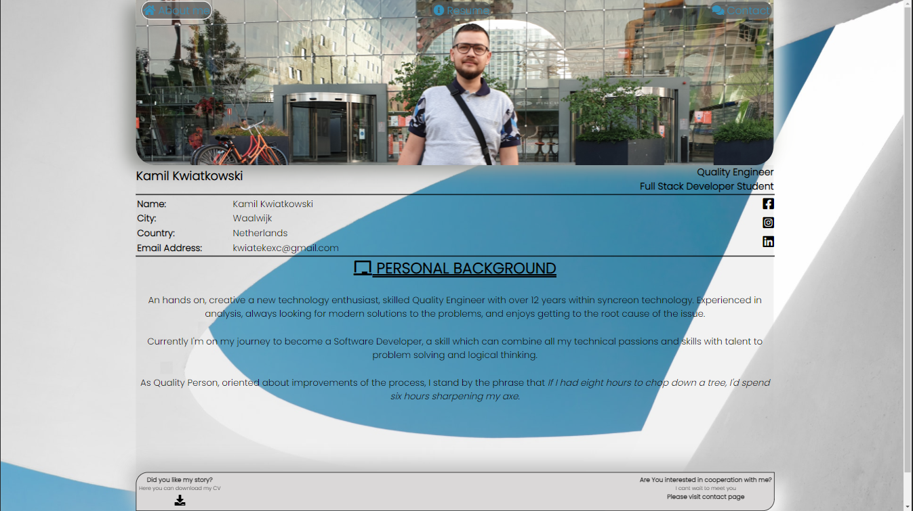

# Kamil Kwiatkowski Curriculum Vitae

## Introduction

Welcome to my first Full Stack Course project. This page is my "Welcome World" project, a way for me to say Hi! to developers world. Webpage will tell you something more about myself and show my achievements.

# See live webpage here

## Table of Contents

1. **UX**
    * **1.1. Strategy**
        * Project Goals
        * User target
        * 1st time visitors
            * Returning visitors
        * User expectations
    * **1.2. Structure**
    * **1.3. Skeleton**
    * **1.4. Surface**
2. **Features**
3. **Technologies Used**
4. **Testing**
5. **Development Cycle**
6. **End Product**
7. **Known Bugs**
8. **Credit**

## 1. UX

My ultimate goal is to change my career path and become a full time developer, therefore I have decided to use my first project to create my own CV website. This could be used currently as part of my own portfolio, where I can show my skills, as well as current achievements and accomplishments.

This project will show my work history and path of becoming a software developer from zero to hero 😊

## 1.1 Strategy

### * Project Goals

The reason for this web page is to show my skills to potential recruiters and all who wants to cooperate with me in the future in projects. The website has been built by using HTML and CSS technologies. 

### * User Target

### First time visitors:

* 1st time Visitors who wants to know more about my background and work history;
* 1st time Visitors who search for work candidates;
* 1st time Visitors who search for developers to work with.

### Returning visitors:

* Visitors who would like to continue cooperation;
* Visitors who search contact details.

### User Expectations:

* Interface is easy to navigate;
* The website is responsive across all devices (mobile, tablet and desktop);
* Content is displayed in a clear and understanding format;
* To have ability to contact with creator;
* User can check my work history;
* User can download printable version of CV.

## 1.2. Structure

To be able to provide for users the best experience on devices which they use, my website have responsive design to cover the majority of currently used devices (mobile, tablet, laptop/desktop). This has been tested and proven to be functional. 

* **All pages** with one consistent layout design being easy to understand and intuitive for all users;
* **Navigation bar** placed on top of the screen easily accessible even once scrolling down, visited pages are in color which matches background blue tone section, the color is defined by paint eyedropper tool;
* **Footer** with downloadable CV color tone from grey part of background picture;
* **About me** includes short about me sentence with interesting quote;
* **Resume** includes work history in chronological
* **Contact** includes contact form and google map iframe 

## 1.3. Skeleton

For creating wireframes I did use a [Balsamiq](https://balsamiq.com/), which helped me with defining layout for three types of devices (desktop, tablets and mobiles).

* **About me - homepage Wireframes:**

* **Resume - Work history page Wireframes:**

* **Contact - Get in touch page Wireframes:**

## 1.4. Surface

Typography

As font of my choice was Poppins provided from [Google Fonts](https://fonts.google.com/) in case of lack of support for Poopins font I did set sans serif font as a backup.

Color

Color has been defined with usage paint eyedrop tool, the reason for that was to ensure consistent design with the background image. 

Icons

The icons were taken from [Font Awsome](https://fontawesome.com/)

## 2. Feature

### All pages:

As goal was to achieve a one consistent layout within all pages, I did include:

* Photo on top of all pages;
* Top navigation bar accessible while scrolling down;
* Contact details below photo;
* Social media icons;
* Standardized information box used for different purposes in all pages;
* Footer with downloadable CV.

### About me

* An short overview to showcase who am I and what I do.

### Resume page:

* Work history in chronological way.

### Contact page:

* Contact form specified type of cooperation.

## 3. Technologies Used

During my page creation journey I did use:

* [HTML5](https://en.wikipedia.org/wiki/HTML)
    * Current project uses HyperText Markup Language.
* [CSS3](https://en.wikipedia.org/wiki/CSS)
    * Current project uses Cascading Style Sheets.
* [Chrome](https://www.google.com/intl/en_uk/chrome/)
    * Chrome dev tool used to debug and test code while building
* [Balsamiq](https://balsamiq.com/)
    * To create wireframes during design
* [Google Fonts](https://fonts.google.com/)
    * Used as a source of Poppins font
* [Font Awsome](https://fontawesome.com/)
    * To provide icons to page
* [Github](http://github.com)
    * For storing project code written in gitpod
* [JS Fiddle](https://jsfiddle.net/)
    * Used as playground for code
* [W3School](https://www.w3schools.com/)
    * For problem solving and code searching

## 4. Testing

### Google developer Tool

Used during entire project to test code and unbug issues   

### Responsive tools

Used google dev tool to test responsivness:

* **Laptop (14"):**

* **Desktop (24"):**

* **iPhone gen 6 up to 8:**

* **iPhone plus gen 6 up to 8:**

* **Samsung Galaxy S5:**

* **iPad:**

### W3C Validator tools

Tested by W3C validators, issues discovered:
* Sections where missing H1-6 tags - corrected to div structure;
* Typo in input hiring ID;
* Atribiute typo in the form tag.

All issues corrected.

## Manual testing

* **Manual testing performed on:**

    * Laptop (14");

    * Desktop (24");

    * iPhone 7 and 8 (5.5");

    * Samsung Galaxy 9 (5.8");

    * Samsung A70 (6.7").

## Page details

* **Navigation Bar:**

    All buttons have text color set to blanchedalmond same as borders -once a site is active. After the visit this will change to sea blue color to match the background image:
    * **About me** button will direct you to the Home page.
    * **Resume** button will direct you to my work history.
    * **Contact** button will direct you to the Contact page.

* **Hero image:**
 
    Was style to achieve multi dimensional, animation added to increase size of hero image to 1.1.

* **Title area:**

    Text was checked against typos, the font size ensured to match the most popular screen sizes.

* **Personal Details:**

    Build in table form to ensure position of the text left right.

* **Middle section (About me, Resume, Contact):**

    Scale to fit most popular devices, add gray transparent background to separate form page background.
    Per page:
    * **About me** - short sentence with quote for visitors.
    * **Resume** - work history in easy to read form.
    * **Contact** - Contact form with decision point (radio buttons);
        * Buttons with soft color in gray tone.

* **Footer:**

    Set to blanchedalmond to compliment top section of the web with shadow to softy blend with the page.

    Footers include downloadable CV under download icon.

* **Responsiveness:**

    Was checked at multiple device sizes to focus on majority of devices currently used worldwide

## 5. Development

I tried multiple layouts & elements in my second respiratory to provide the most user friendly interface. The design of the website and the content was created by myself, there was no design bots used to help with development.
I have defined responsivness break points based on precentage of the most popular devices screen size used in 2021. 
The code was reviewed multiple times to ensure all dead codes are cleaned, and it's readable for the other testers/ users. 
CSS code was cleaned and condensed (in total over 200 lines of CSS code lines were removed)
Code has been runned by HTML/ CSS beautifier to improve code outlook. 

* **All pages:**
 
During the first days of the project I did use different pictures for positioning, however I changed it later to my own picture.

Original design was with only a grey color background. I have changed that recently to provide a more complimentary photo to the hero image. Based on that, I was able to apply a grey transparent box to highlight the text section.

## 6. End Product

See End Product screens:

## 7. Known bugs

* Incorrect data send from form - fixed by providing correct names;
* Multiple lines reacting in the same way - reduced in last stage of project;
* Nav bar was hidden once animated fixed by z-index;
* Incorrect link to download file;
* CSS typo - incorrect declaration in animation rule.

## 8. Credits

* **Code:**

    * Icons came from [Font Awsome](https://fontawesome.com/)
    * Font came from [Google Fonts](https://fonts.google.com/)
    * Shadows code from [Neumorphism/Soft UI CSS shadow generator](https://neumorphism.io/#e0e0e0) thank you for sharing @Aukje - Red Pepper_Alumni

* **Content:**

    * Background photo download from [Pexels](https://www.pexels.com/) Author: Matheus Natan
